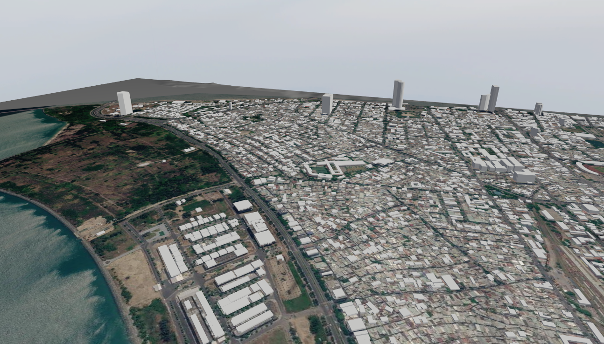

# RTL-Gazebo-Worlds-Library
This repository contains models and world files for Gazebo, created by RealTech Laboratory.



We offer this collection free of charge for research purposes. We would be pleased if you would use it in your research and cite it as follows: **Dong LT.  Tran, & REAL Tech Lab. (2026). REALTechLab/RLTLab-Gazebo-Worlds-Library: RLTLab Gazebo World 55000 (Version v260903) [Computer software]. Zenodo. https://doi.org/10.5281/ZENODO.22277597**
## 🛠️ Install
#### 1. Clone project
```bash
git clone https://github.com/REALTechLab/RLTLab-Gazebo-Worlds-Library.git
```

#### 2. Run the world
```bash
cd RLTLab-Gazebo-Worlds-Library
cd worlds
cd 55000-***** <***** is name of district>
gz sim 55000-*****.world 
```

## ⚙️ Zones

+ 55000-HAICHAU: 3D geographical map of Hai Chau Ward, Da Nang City, Vietnam
+ 55000-LIENCHIEU: 3D geographical map of Lien Chieu Ward, Da Nang City, Vietnam
+ 55000-HAIVAN: 3D geographical map of Hai Van Ward, Da Nang City, Vietnam
+ 55000-THANHKHE: 3D geographical map of Thanh Khe Ward, Da Nang City, Vietnam
+ 55000-HOAKHANH: 3D geographical map of Hoa Khanh Ward, Da Nang City, Vietnam
+ 55000-NGUHANHSON: 3D geographical map of Ngu Hanh Son Ward, Da Nang City, Vietnam
+ 55000-SONTRA: 3D geographical map of Son Tra Ward, Da Nang City, Vietnam
+ 55000-dtuhkn: 3D geographical map of Duy Tan University Campus Hoa Khanh, Da Nang City, Vietnam


## 🔗 Ref

* [Documentation/Website](https://rltlab.io.vn)
